# Yield Report

## Objective

This section evaluates whether heat treatment changes cranberry yield outcomes in the `long-term` and `acute` experiments. We study three outcomes separately:

- `healthy_weight_g`
- `pct_rotten_count`
- `pct_rotten_weight`

The main scientific questions are:

1. Does heat treatment change yield outcomes?
2. Are the effects similar in the long-term and acute experiments?
3. Do cultivar and heat intensity modify those effects?

## Data Preparation

The yield analysis used the locked datasets after cleaning and pairing checks:

- `cleaned_data/longterm_yield_analysis_locked.csv`
- `cleaned_data/acute_yield_analysis_locked.csv`

The cleaning step focused on:

- standardizing treatment and cultivar labels
- resolving pairing structure between heat and control plots
- removing rows that could not be matched reliably

After cleaning, the analysis used:

- `long-term`: 16 observations, 8 heat-control pairs
- `acute`: 48 observations, 24 heat-control pairs

## Methods

We used two complementary summaries.

1. Paired descriptive summaries  
   For each matched pair, we computed `heat - control` to show the direction and magnitude of the treatment effect.

2. Mixed-effects models as the primary inference framework  
   These models were used because the experiment has grouped and paired structure.

Model specifications:

- `long-term`: `outcome ~ C(cultivar) * C(heat_trt) + (1 | cultivar:set_id)`
- `acute`: `outcome ~ C(cultivar) * C(heat_level) * C(is_control) + (1 | cultivar:heat_level:replicate)`

In the acute models, `is_control = 1` corresponds to the control plot. Therefore:

- a positive control coefficient for `healthy_weight_g` means control plots had higher healthy fruit weight than heated plots
- a negative control coefficient for rotten outcomes means control plots had lower rot than heated plots

## Long-Term Results

### Descriptive paired summaries

Overall paired differences (`heat - control`) were:

- `healthy_weight_g`: `-61.664 g`, `p = 0.340`
- `pct_rotten_count`: `-0.0397`, `p = 0.0146`
- `pct_rotten_weight`: `-0.0152`, `p = 0.134`

These descriptive summaries suggest that, on average, long-term heated plots had lower healthy fruit weight and somewhat lower rot proportions, although only rotten-count proportion was significant in the simple paired comparison.

### Mixed-model results

The mixed models showed:

- `healthy_weight_g`
  - cultivar effect: `p = 1.35e-05`
  - heat treatment effect: `p = 0.0426`
  - treatment estimate for OTC: `-125.9 g`
- `pct_rotten_count`
  - heat treatment effect: `p = 0.0373`
  - treatment estimate for OTC: `-0.0322`
- `pct_rotten_weight`
  - cultivar effect: `p = 7.45e-04`
  - heat treatment effect: `p = 0.0167`
  - treatment estimate for OTC: `-0.0255`

No cultivar-by-treatment interaction term was significant in the long-term models.

### Interpretation

The long-term experiment shows that both cultivar and treatment matter, but the pattern is mixed across outcomes:

- healthy fruit weight tends to decrease under long-term heat treatment
- rotten-count and rotten-weight proportions also decrease in the fitted long-term models
- the absence of strong interaction terms suggests that the main story is driven by treatment and cultivar main effects rather than strong cultivar-specific treatment responses

## Acute Results

### Descriptive paired summaries

By heat level, the paired differences (`heat - control`) for `healthy_weight_g` were:

- `A`: `-175.710 g`, `p = 0.0488`
- `B`: `-64.003 g`, `p = 0.529`
- `C`: `-216.547 g`, `p = 9.10e-05`
- `D`: `-165.075 g`, `p = 0.235`

For `pct_rotten_count`, the paired differences were:

- `A`: `+0.1294`, `p = 0.0180`
- `B`: `+0.0694`, `p = 0.0240`
- `C`: `+0.0869`, `p = 0.0476`
- `D`: `+0.1453`, `p = 0.0631`

For `pct_rotten_weight`, the paired differences were:

- `A`: `+0.0867`, `p = 0.0771`
- `B`: `+0.0539`, `p = 0.0319`
- `C`: `+0.0744`, `p = 0.0143`
- `D`: `+0.1451`, `p = 0.0508`

These summaries indicate a clear short-term stress pattern: heated plots usually have lower healthy fruit weight and higher rot proportions.

### Mixed-model results

The acute mixed models showed:

- `healthy_weight_g`
  - treatment-vs-control term `C(is_control)`: `p = 0.0245`
  - control coefficient: `+225.7 g`
- `pct_rotten_count`
  - treatment-vs-control term `C(is_control)`: `p = 0.0183`
  - control coefficient: `-0.1123`
- `pct_rotten_weight`
  - treatment-vs-control term `C(is_control)`: `p = 0.0740`
  - control coefficient: `-0.0808`

Global heat-level and higher-order interaction terms were not strongly significant.

### Interpretation

The acute experiment has a clearer directional story than the long-term experiment:

- control plots have more healthy fruit weight than heated plots
- control plots have lower rotten proportions than heated plots
- the most stable acute signal is the treatment-vs-control contrast itself
- evidence for a strong global heat-level interaction is limited

This supports the interpretation that acute heat acts mainly as a short-term stressor on yield.

## Figures

### Long-Term Outcome Distributions

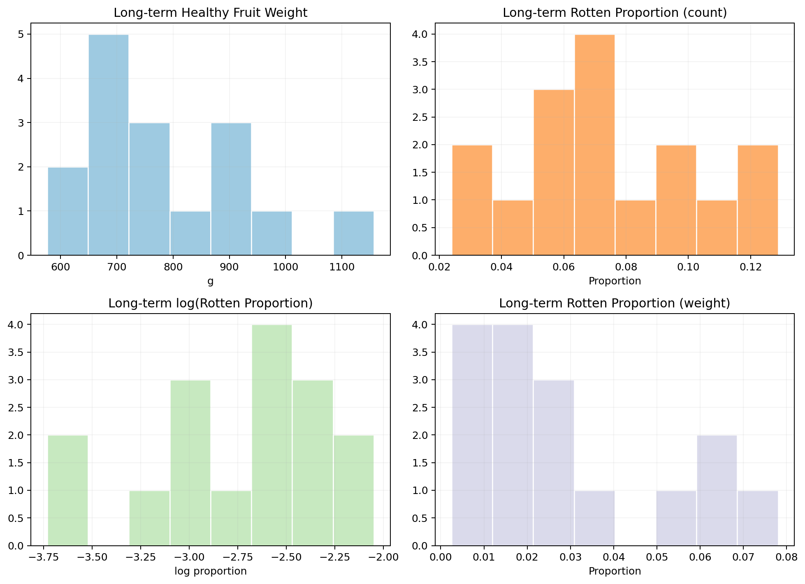

### Long-Term Observed Means with Standard Errors

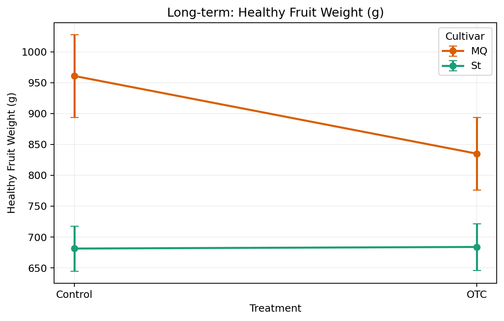

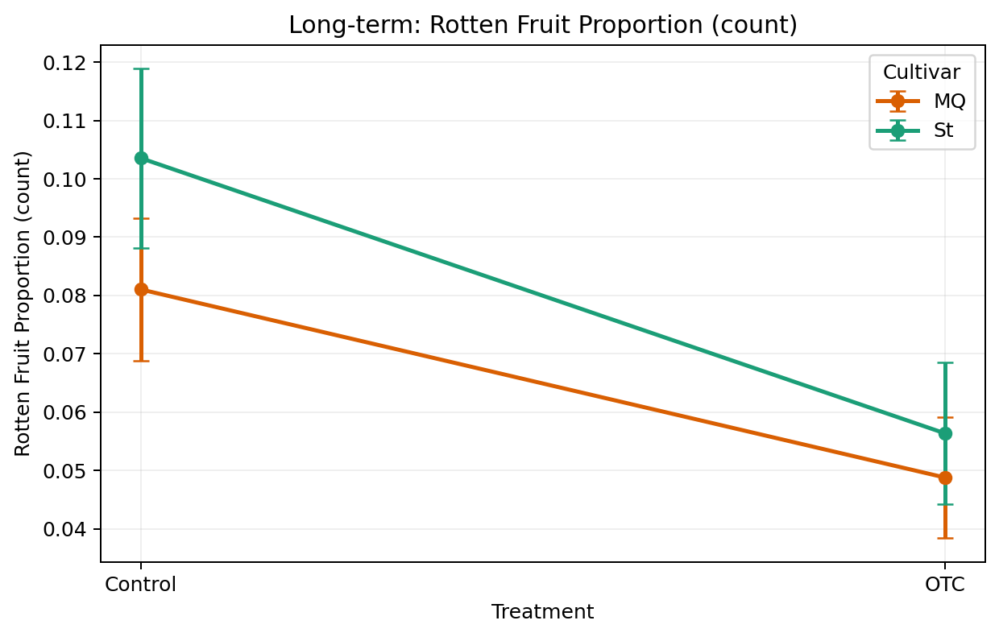

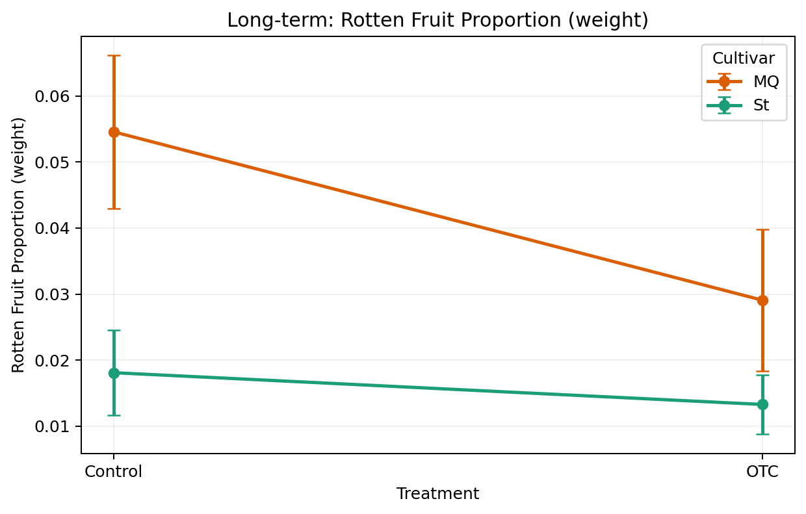

### Long-Term Mixed-Model Fitted Means

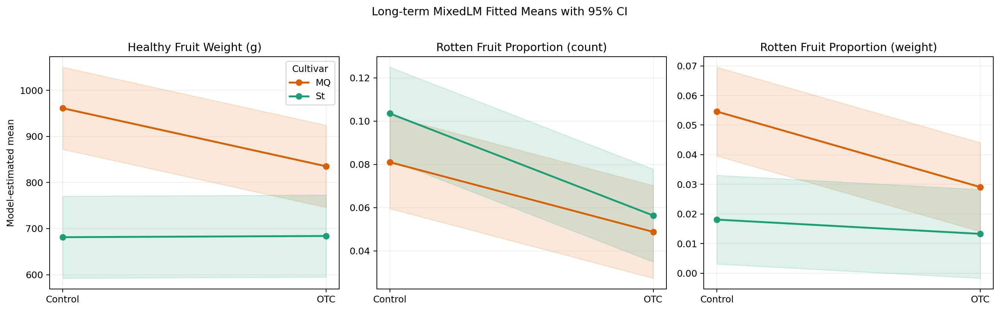

### Long-Term Diagnostic Checks

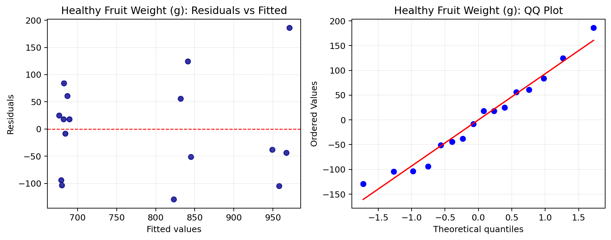

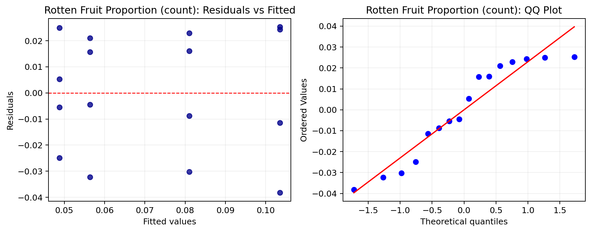

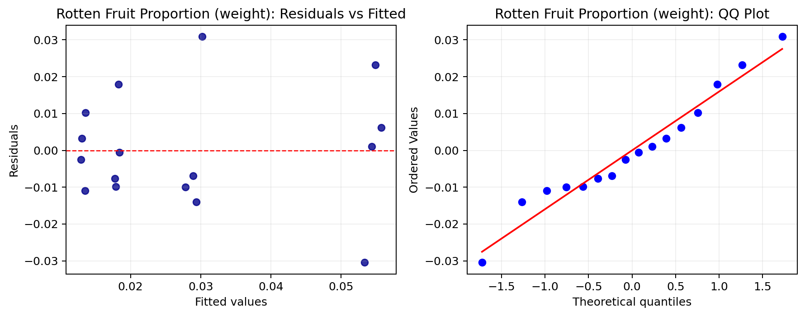

### Acute Observed Means with Standard Errors

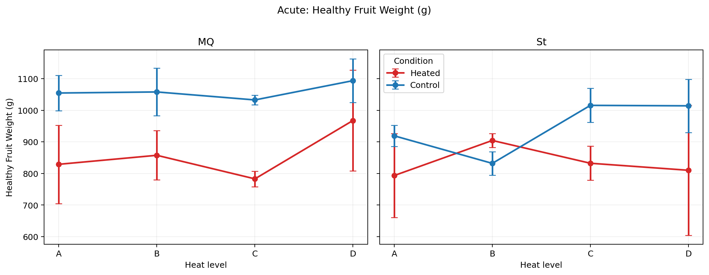

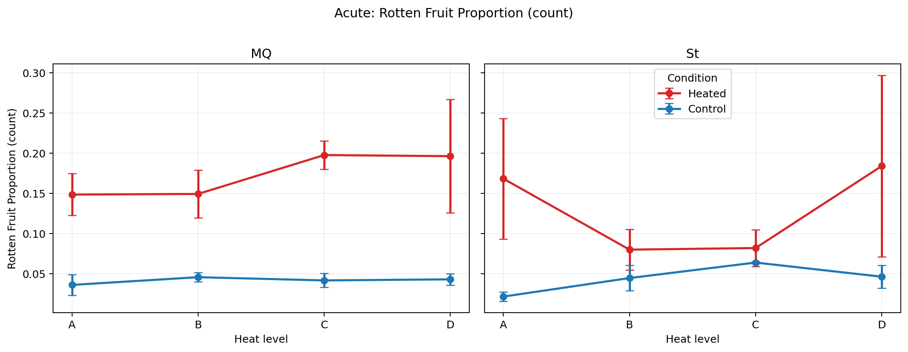

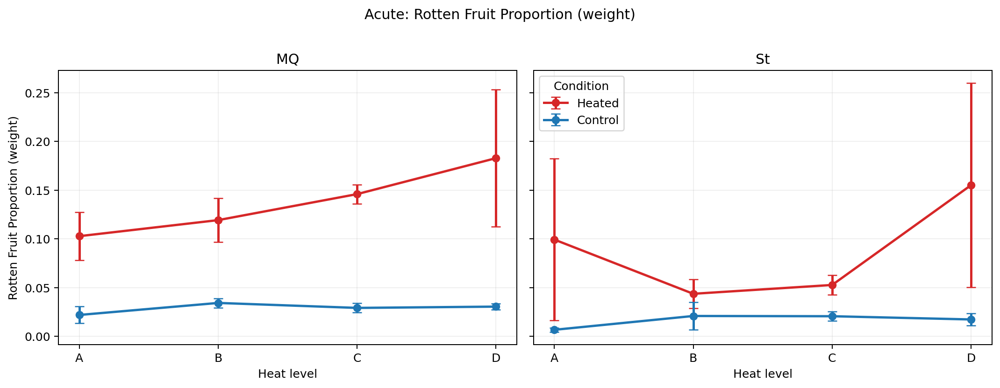

### Acute Mixed-Model Fitted Means

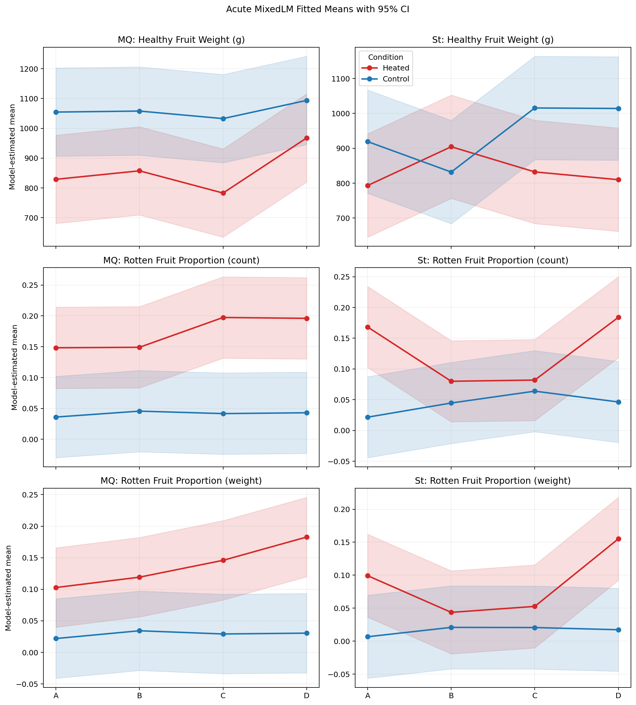

### Acute Diagnostic Checks

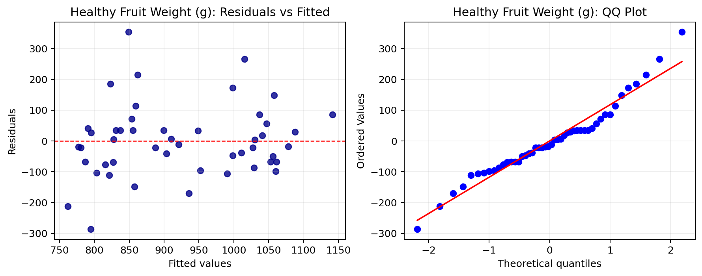

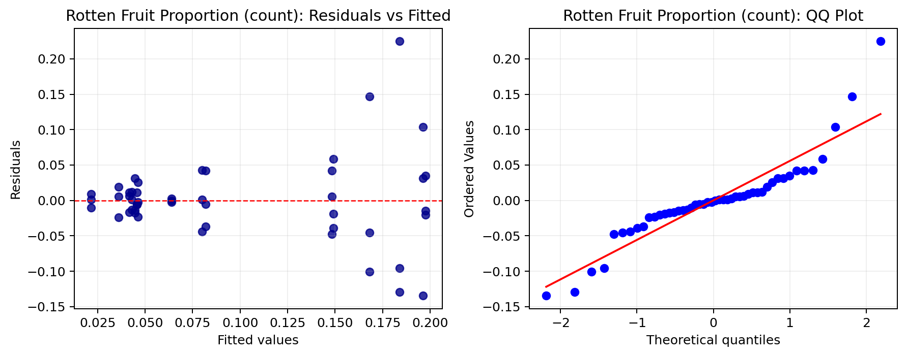

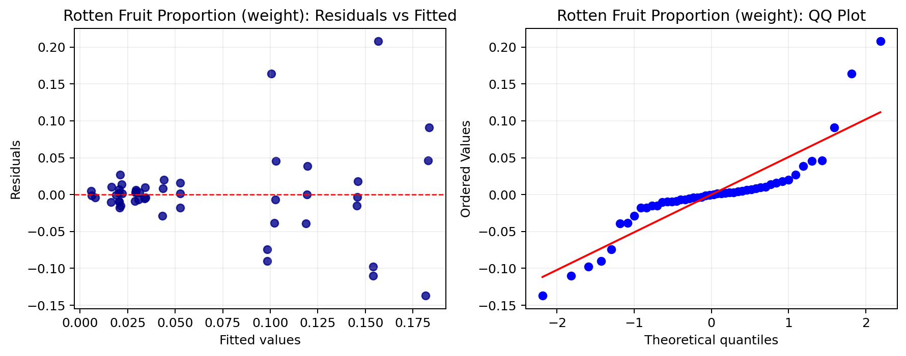

## Conclusion

Overall, the yield analysis shows that heat treatment does affect cranberry outcomes, but the pattern depends on experiment type.

- In the `acute` experiment, heat treatment behaves like a short-term stressor: healthy fruit weight tends to drop and rotten proportions tend to increase.
- In the `long-term` experiment, treatment effects are still present, but they are more mixed across outcomes and are also shaped by cultivar differences.
- Across both experiments, the evidence for strong global interaction structure is limited, so the most defensible report emphasis is on the main treatment effects.

## Related Files

- `notebooks/yield_analysis.ipynb`
- `notebooks/yield_regression_plots.ipynb`
- `notebooks/yield_summary_english.ipynb`
- `results/yield/yield_analysis_report.md`
- `results/yield/yield_longterm_summary.csv`
- `results/yield/yield_acute_summary.csv`
- `results/yield/yield_longterm_mixedlm_coefficients.csv`
- `results/yield/yield_longterm_mixedlm_wald_terms.csv`
- `results/yield/yield_acute_mixedlm_coefficients.csv`
- `results/yield/yield_acute_mixedlm_wald_terms.csv`
